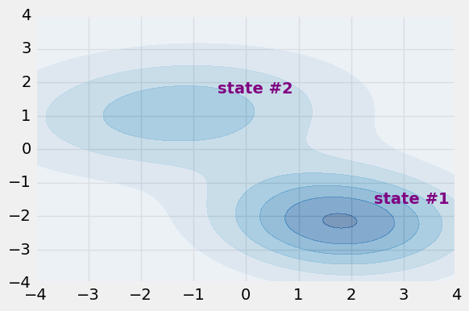

```python
# imports
from tf_hmm import HiddenMarkovModel
from toy_dataset import toy_dataset
import tensorflow as tf
import time
%matplotlib inline 
```


```python
dataset = toy_dataset(1000,32)
```


```python
hmm = HiddenMarkovModel(2,2,reports=True)
```


```python
hmm.expectation_maximization(dataset,max_steps=1000)
```

    the computation graph has been recreated in 2.5 sec
    the training process has been converged in 13 steps in 2.4 sec


```python
hmm.plot()
```





```python
hmm.mu
```


    array([[ 1.80040165, -2.15167103],
           [-1.29833214,  1.11217551]])


```python
hmm.cov
```


    array([[[ 1.6233517 , -0.14151129],
            [-0.14151129,  1.07758101]],
    
           [[ 2.29823099,  0.32517588],
            [ 0.32517588,  1.28161531]]])


```python
hmm.p0
```


    array([ 0.15488769,  0.84511231])


```python
hmm.tp
```


    array([[ 0.52553154,  0.47446846],
           [ 0.19438977,  0.80561023]])


```python

```
